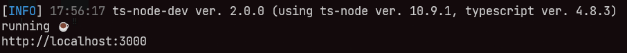

<h1 align="center"> 🎮 eSports 🕹️</h1>

### Descrição

#### O aplicativo web e mobile em questão é uma plataforma que tem como objetivo ajudar o usuário a encontrar seu duo ideal. Por meio de algoritmos e perfis criados pelos próprios usuários, a plataforma sugere possíveis matches, permitindo que os usuários se comuniquem e se conheçam melhor. O app é voltado para pessoas que procuram uma duo para sua jogatina. A plataforma utiliza uma interface intuitiva e de fácil uso, permitindo que o usuário navegue e encontre seu duo de forma rápida e eficiente 

### 🚀 Iniciando o projeto

#### Clone o projeto com <a href="https://git-scm.com/">git</a>

```bash
# Na pasta que voce deseja clonar o projeto abra o terminal e escreva
$ git clone https://github.com/rafaelmasselli/eSports-ReactTs-ReactNativeTs-NodeTs
```

### 🤖 Para iniciar o servidor do projeto voce ira precisar do <a href="https://nodejs.org/en/">Node js</a>

```bash
# Entre na pasta "server" e instale as dependências
$ npm install
# Crie uma migrate do banco SQLite
$ npx prisma migrate dev
# E agora incie o projeto
$ npm run dev
```

### E assim ira estar rodando o back-end do projeto



### 📱 Para iniciar o projeto mobile voce vai precisa de um <a href="https://developer.android.com/studio?hl=pt&gclid=CjwKCAjwrNmWBhA4EiwAHbjEQO2goxDIGd17_CS6dWYZQUpr_eapfClqO4QX9K-pLNXDxh9DBe0PVRoCbr0QAvD_BwE&gclsrc=aw.ds">emulador</a> ou do expo instalado no smartphone

```bash
# Entre na pasta "mobile" e instale as dependências
# Instalando as dependências
$ npm install
# Iniciando o projeto mobile
$ expo start
# Aperte "A" para instalar automaticamente o expo no android studio
```

#### E assim iria abrir o projeto no mobile

<div align="center" >

   

</div>
#### Para iniciar o projeto web voce vai precisar do <a href="https://nodejs.org/en/">Node js</a>

```bash
# Entre na pasta "client" e instale as dependências
$ npm install
# E agora incie o projeto
$ npm run dev
```

### 🖥️ E assim iria abrir o projeto no web

<div align="center">


</div>

### 🔖 Layout

Você pode visualizar o layout do projeto através do link abaixo:

- [Layout](https://www.figma.com/community/file/1150897317533332617)

Lembrando que você precisa ter uma conta no [Figma](http://figma.com/).
